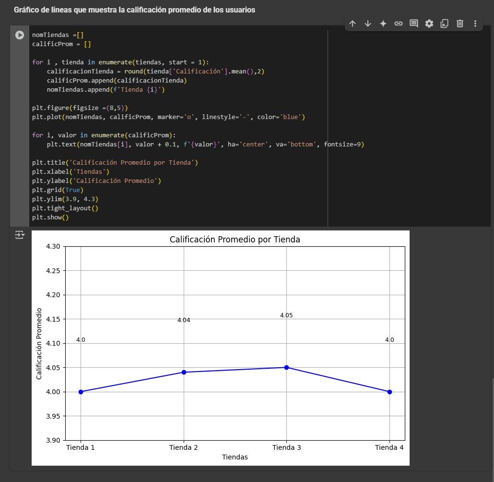

---

# Challenge: AluraStores: análisis de la tienda de menor rendimiento

---

Este es un proyecto de Análisis de datos aplicando teoría básica del uso de python para el análisis de datos tomado del curso de DataScience de Alura Latam, en el que podemos tomar datos de tipo csv e importarlos para el análisis de los mismos, también con dichos datos tomamos diferentes tipos de análisis, para este caso sobre 4 tiendas en temas de: facturación, ventas por categoría de los productos más populares, calificaciones promedio de los usuarios, productos más y menos vendidos, costo de envío promedio y finalmente se toman 3 de estos tipos de parámetros ys e grafican para una mejor interpretación.

---

### 🚀 Características

1. Importar datos en formato csv para análisis con python.

2. Analiza carácterísticas especiales extraídas de los datos obtenidos.

3. Generar gráficos para facilitar la interpretación visual.

4. Dar un panorama de tipo analítico u crítico de la situación para tomar una buena decisón a la problemática dada.

---

### 📂 Estructura del Proyecto

##### 📁 challenge alura store/ 
│── assets/ (Imágenes y otros recursos) 
│── AluraStoreLatam.ipynb (Lógica) 

---

### 🛠 Tecnologías Utilizadas

- Python 3
- Colab (google)

---

### 📝 Uso

- Descarga el archivo terminado en extensión .ipynb:

- Abre Colab:  `https://colab.research.google.com/`

- Sube el archivo descargado en el primer paso.

- Ingresa a mirar todo el código y los análisis que se toman del caso para llegar a la conclusión o análisis final

---

### 📜 Licencia

Este proyecto está bajo la licencia MIT. ¡Siéntete libre de usarlo y mejorarlo! 🎉 